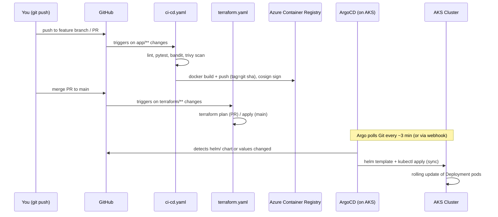

# City Population API

A small FastAPI service for storing and looking up city population data,
backed by Elasticsearch. It's packaged as a Helm chart for Kubernetes, with
Docker Compose for local dev, and comes with the Terraform + GitHub Actions
+ ArgoCD setup we use to run it on AKS.

## Repo layout

```
city-population-ak8s/
├── app/                          # The FastAPI service itself
│   ├── main.py
│   ├── requirements.txt          # Runtime deps
│   ├── requirements-dev.txt      # + pytest, ruff, bandit
│   └── tests/test_main.py        # Unit tests, ES client mocked out
├── Dockerfile                    # Multi-stage, runs as non-root
├── docker-compose.yml            # API + Elasticsearch, for local testing
├── helm/                         # Helm v3 chart
│   ├── Chart.yaml
│   ├── values.yaml
│   └── templates/
│       ├── deployment.yaml           # App Deployment + PDB + optional HPA
│       ├── service.yaml
│       ├── elasticsearch.yaml        # StatefulSet + headless Service + PVC
│       ├── secret.yaml               # ES credentials (dev only, see notes below)
│       ├── secretproviderclass.yaml  # Optional Key Vault CSI wiring
│       ├── networkpolicy.yaml        # Locks down access to Elasticsearch
│       ├── _helpers.tpl
│       └── NOTES.txt
├── terraform/                    # AKS + ACR + everything around them
│   ├── versions.tf                   # Providers + remote state backend
│   ├── variables.tf
│   ├── main.tf                       # Resource group, networking, ACR, AKS, Log Analytics
│   ├── key_vault.tf                  # Key Vault + AKS CSI driver wiring
│   ├── identity.tf                   # GitHub OIDC app registration + role assignments
│   ├── outputs.tf
│   └── dev.tfvars
├── .github/workflows/
│   ├── ci-cd.yaml                    # Lint, test, scan, build, push, sign
│   └── terraform.yaml                # Plan on PR, apply on merge to main
├── argocd/
│   ├── project.yaml                  # AppProject - scopes what ArgoCD can touch
│   └── application.yaml              # Application - syncs helm/ onto AKS
├── scripts/
│   ├── bootstrap-tfstate.sh          # One-off: creates the remote state storage account
│   ├── bootstrap-argocd.sh           # Installs ArgoCD and registers the app
│   └── smoke-test.sh                 # Hits the running API and checks the responses
└── README.md
```

---

## How a commit gets deployed to AKS



Two independent pipelines, plus a GitOps sync loop, cover the whole path:

1. **App code** (`app/**`, `Dockerfile`) → `ci-cd.yaml` lints, tests, scans,
   builds the image, and pushes it to ACR tagged with the commit SHA. This
   pipeline never touches the cluster.
2. **Infrastructure** (`terraform/**`) → `terraform.yaml` plans on every PR
   and applies on merge to `main`, using GitHub OIDC (no stored cloud
   credentials). This is what creates/updates AKS, ACR, networking, Key
   Vault, etc.
3. **Deploying the new image** is GitOps, not pipeline-driven: ArgoCD
   (already running in-cluster) watches `helm/` on the branch set in
   `argocd/application.yaml` and reconciles the cluster to match whatever's
   in Git. Nothing gets applied to AKS until a commit actually changes the
   chart or its values.

The loop is fully closed: `ci-cd.yaml`'s `update-manifests` job bumps
`helm/values.yaml`'s `image.repository`/`image.tag` to the image it just
built and pushed, and commits that change back to `main` as
`github-actions[bot]` (with `[skip ci]` so the bump itself doesn't
retrigger the pipeline). ArgoCD picks up that commit on its next
poll/webhook and reconciles the cluster: a commit to app code ends up
running on AKS with no manual steps in between.

---

## Deployment Guide

### Prerequisites
- Docker + Docker Compose
- A local Kubernetes cluster: [Kind](https://kind.sigs.k8s.io/) or
  [Minikube](https://minikube.sigs.k8s.io/)
- `kubectl` and `helm` v3 CLIs
- `curl` for testing

### 1. Run locally with Make (fastest path)

**Automated smoke test via Makefile:**

```bash
# Start API + Elasticsearch in the background
make compose-up

# Run end-to-end checks for /health, upsert, query, 404, and 422 behavior
make smoke-test

# Tear down
make compose-down
```

This starts a single-node Elasticsearch and the API, with the API waiting
(via its own startup retry logic) for Elasticsearch to become healthy
before serving traffic. The API is exposed at `http://localhost:8000`.

**Test it:**

```bash
# Health check
curl http://localhost:8000/health
# {"status":"OK"}

# Upsert a city
curl -X POST http://localhost:8000/cities \
  -H "Content-Type: application/json" \
  -d '{"city": "Warsaw", "population": 1863056}'
# {"city":"Warsaw","population":1863056,"updated_at":"..."}

# Update the same city (upsert)
curl -X POST http://localhost:8000/cities \
  -H "Content-Type: application/json" \
  -d '{"city": "Warsaw", "population": 1870000}'

# Query it
curl http://localhost:8000/cities/Warsaw
# {"city":"Warsaw","population":1870000,"updated_at":"..."}

# Query a city that doesn't exist -> structured 404
curl -i http://localhost:8000/cities/Atlantis
# HTTP/1.1 404 Not Found
# {"error":"city_not_found","detail":"No population data found for city 'Atlantis'.","request_id":"..."}
```

Interactive API docs (Swagger UI) are available at `http://localhost:8000/docs`.


### 2. Build the container image directly

```bash
docker build -t city-population-api:1.0.0 .
```

### 3. Spin up a local Kubernetes cluster

**Using Minikube:**

```bash
minikube start
minikube image load city-population-api:1.0.0
# Alternatively, build directly inside Minikube's Docker daemon:
# eval $(minikube docker-env)
# docker build -t city-population-api:1.0.0 .
```

### 4. Deploy with Helm

The chart deploys into its own dedicated `city-population` namespace by
default (see `namespaceOverride`/`createNamespace` in `helm/values.yaml`),
so pass `--create-namespace` on first install and `-n city-population` on
every subsequent Helm/kubectl command.

**Docker Desktop / restricted-local-cluster notes**
If your local cluster enforces strict non-root policies, Elasticsearch init
containers that require `runAsUser: 0` can be blocked. In that case, install
with those init containers disabled:
```bash
helm upgrade --install city-population ./helm \
  --namespace city-population --create-namespace \
  --set app.image.repository=city-population-api \
  --set app.image.tag=1.0.0 \
  --set elasticsearch.initContainers.fixVmMaxMapCount.enabled=false \
  --set elasticsearch.initContainers.fixDataPermissions.enabled=false
```

If a previous release is stuck in crash loop with old settings, reset and
reinstall:
```bash
helm uninstall city-population --namespace city-population || true
kubectl delete pvc es-data-city-population-elasticsearch-0 -n city-population --ignore-not-found=true
helm install city-population ./helm \
  --namespace city-population --create-namespace \
  --set app.image.repository=city-population-api \
  --set app.image.tag=1.0.0 \
  --set elasticsearch.initContainers.fixVmMaxMapCount.enabled=false \
  --set elasticsearch.initContainers.fixDataPermissions.enabled=false
```

When using Docker Desktop behind a corporate proxy, ensure the local API host
is excluded so `kubectl` can talk to the cluster directly:

```bash
export NO_PROXY="$NO_PROXY,kubernetes.docker.internal"
export no_proxy="$no_proxy,kubernetes.docker.internal"
kubectl config use-context docker-desktop
kubectl get nodes
```

Check that everything came up:

```bash
kubectl get pods -n city-population
kubectl get pvc -n city-population
kubectl get statefulset -n city-population
```

### 5. Access the API

```bash
kubectl port-forward svc/city-population-api 8000:80 -n city-population
```

Then run the same `curl` commands from step 1 against `http://localhost:8000`.

### 6. Upgrade / uninstall

```bash
helm upgrade city-population ./helm --namespace city-population
helm uninstall city-population --namespace city-population
```

Note: the Elasticsearch PVC is not deleted automatically by `helm
uninstall` (by design, to prevent accidental data loss). Remove it
explicitly if you want a clean slate:

```bash
kubectl delete pvc -n city-population -l app.kubernetes.io/component=database
```

---

## Infrastructure as Code (Terraform → AKS + ACR)

`terraform/` provisions everything the app needs on Azure: a resource
group, a VNet/subnet, Log Analytics (Container Insights), Azure Container
Registry, an AKS cluster (system + autoscaling user node pool, Azure AD
Workload Identity enabled, Azure CNI + network policy, AAD RBAC), a Key
Vault, and an Azure AD App Registration federated for GitHub Actions OIDC
(no client secrets stored anywhere).

### One-time setup

```bash
# 1. Bootstrap the remote state storage account (idempotent, run once per env)
./scripts/bootstrap-tfstate.sh dev westeurope

# 2. Edit the tfvars for your environment if any changes
cd terraform
vim dev.tfvars
# set github_repository to your actual "org/repo"

# 3. Init with the backend values printed by the bootstrap script
terraform init \
  -backend-config="resource_group_name=<tfstate-rg>" \
  -backend-config="storage_account_name=<tfstate-sa>" \
  -backend-config="container_name=tfstate" \
  -backend-config="key=city-population/dev.tfstate" \
  -backend-config="use_azuread_auth=true"
# `use_azuread_auth=true` authenticates to the state storage account via your
# `az login`/OIDC identity's RBAC role (Storage Blob Data Contributor) rather
# than a storage account access key - no key ever needs to be generated or
# stored. The same flag is used by both GitHub Actions workflows below.

# 4. Plan and apply
terraform plan  -var-file=dev.tfvars
terraform apply -var-file=dev.tfvars
```

### Wire the outputs into GitHub

```bash
terraform output acr_login_server
terraform output acr_name
terraform output github_actions_client_id
terraform output github_actions_tenant_id
terraform output github_actions_subscription_id
```

In the GitHub repo (Settings → Secrets and variables → Actions), set:

| Name | Type | Value |
|---|---|---|
| `AZURE_CLIENT_ID` | Secret | `github_actions_client_id` output |
| `AZURE_TENANT_ID` | Secret | `github_actions_tenant_id` output |
| `AZURE_SUBSCRIPTION_ID` | Secret | `github_actions_subscription_id` output |
| `ACR_NAME` | Variable | `acr_name` output |
| `ACR_LOGIN_SERVER` | Variable | `acr_login_server` output |
| `TF_STATE_RG` / `TF_STATE_SA` / `TF_STATE_CONTAINER` / `TF_STATE_KEY` | Variables | printed by `bootstrap-tfstate.sh` |

Set the three `AZURE_*` values as **Secrets** and everything else as
**Variables** only - `${{ secrets.* }}` and `${{ vars.* }}` are looked up
independently, so a name defined in both resolves to the Secret and can mask
a Variable update. Only `AZURE_CLIENT_ID`/`AZURE_TENANT_ID`/
`AZURE_SUBSCRIPTION_ID` need Secret-level protection (and even those aren't
truly sensitive on their own, since OIDC still requires the matching
federated credential's trust conditions to be met); the rest are plain
config and don't need to be write-protected as Secrets.

No password/secret ever needs to be stored: `AZURE_CLIENT_ID` +
`AZURE_TENANT_ID` + `AZURE_SUBSCRIPTION_ID` are used with `azure/login@v2`'s
OIDC flow, trusted via the federated credentials created in
`terraform/identity.tf` (scoped to this exact repo + GitHub Environment).

> **GitHub's immutable OIDC subject claims:** for repos created/renamed/
> transferred after 2026-07-15, GitHub issues federated token `sub` claims
> with numeric owner/repo IDs embedded (`repo:OWNER@OWNER_ID/REPO@REPO_ID:...`)
> instead of the legacy `repo:owner/repo:...` format. If `azure/login@v2`
> fails with `AADSTS700213: No matching federated identity record found`,
> set `github_owner_id`/`github_repo_id` in `dev.tfvars` to the numeric IDs
> from `https://api.github.com/repos/<owner>/<repo>` (`.id` and `.owner.id`)
> and re-apply - `terraform/identity.tf` builds the federated credential
> `subject` from these.

Get cluster credentials locally:

```bash
$(terraform output -raw get_credentials_command)
```

> Before your first `apply`, it's worth running
> `terraform fmt -recursive && terraform validate` and `helm lint ./helm`
> locally just to catch any environment-specific issues early.

---

## CI/CD Pipeline (GitHub Actions + DevSecOps)

`.github/workflows/ci-cd.yaml` runs on every push/PR touching `app/`,
`Dockerfile`, or `helm/`:

1. **Lint & test**: `ruff` (style/correctness), `pytest` (16 unit tests
   against a mocked Elasticsearch client, no live cluster needed), results
   published as a check-run annotation.
2. **SAST**: `bandit` scans `main.py` for insecure code patterns; results
   uploaded as SARIF to GitHub Code Scanning.
3. **Secret scanning**: `gitleaks` scans the full git history on every run
   so a credential can't slip in via a squashed/rebased commit.
4. **Dockerfile lint**: `hadolint` catches insecure or inefficient
   Dockerfile patterns (e.g. missing pinned versions, running as root).
5. **IaC scanning**: `checkov` and `tfsec` scan `terraform/`, `helm/`, and
   the `Dockerfile` for misconfigurations (open ingress, missing encryption,
   overly broad IAM, etc.), uploaded as SARIF.
6. **Build & image scan**: builds the image with Buildx (layer-cached via
   `type=gha`), then `trivy` scans it for CRITICAL/HIGH CVEs. The
   pipeline fails the build if any are found (`exit-code: 1`), so
   vulnerable images never reach ACR.
7. **Push & sign**: only after every prior gate passes, the image is
   pushed to ACR and keylessly signed with `cosign` (using the same GitHub
   OIDC identity, so there's no signing key to manage or rotate).
8. **GitOps update**: the pipeline still does **not** run `kubectl apply`
   or `helm upgrade` itself. Instead, the `update-manifests` job bumps
   `app.image.tag` (and `app.image.repository`) in `helm/values.yaml` and
   commits that change back to `main` (as `github-actions[bot]`, with
   `[skip ci]`). ArgoCD (see the GitOps section below) picks up the commit
   and reconciles the cluster, keeping CI (build/test/scan) and CD (sync)
   as separate concerns, which also means the CI identity never needs
   cluster-admin (it only has `contents: write` on the repo, plus
   `AcrPush` and AKS "Cluster User" on Azure).

`.github/workflows/terraform.yaml` is a separate pipeline for
infrastructure changes: `terraform plan` runs on every PR (and every push)
touching `terraform/` and is posted as a PR comment for review, with its
output saved as the `tfplan` artifact; `terraform apply` runs only on merge
to `main`, gated behind the `dev` GitHub Environment (configure required
reviewers there for a manual approval gate before infrastructure changes
land). The `apply` job downloads that same `tfplan` artifact and runs
`terraform apply tfplan`, so it applies exactly what was reviewed rather
than re-planning at apply time. Both workflows also support
`workflow_dispatch` for on-demand manual runs.

**Why two pipelines?** The app pipeline's identity only needs `AcrPush` +
AKS "Cluster User" (read kubeconfig) and can't modify infrastructure. The
Terraform pipeline needs materially broader Azure permissions
(Contributor + User Access Administrator scoped to the resource group) to
manage AKS/ACR/networking themselves. Keeping them separate means a
compromised app-build workflow can push a bad image (caught by the scans
above) but can't, say, open up the AKS API server to the internet.

---

## GitOps Deployment (ArgoCD)

If the AKS API server is fully private (`enable_private_cluster = true` and
`api_server_authorized_ip_ranges = []`, the default in `dev.tfvars`), direct
`kubectl`/`az aks get-credentials` access never works from a local machine
or GitHub-hosted runner. All commands below therefore run through
[`scripts/bootstrap-argocd.sh`](scripts/bootstrap-argocd.sh), which uses
`az aks command invoke` (executes kubectl inside the cluster via the ARM
control plane) instead of a direct connection. This works regardless of
network reachability, as long as the cluster is running and the caller has
`Microsoft.ContainerService/managedClusters/runCommand/action` (covered by
the `Contributor` role already granted in `terraform/identity.tf`). If your
cluster does have direct API server access (e.g. `enable_private_cluster =
false`, or you're on a VPN/self-hosted runner with connectivity), the same
`kubectl`/`argocd` commands work as-is, just drop the `az aks command
invoke --command "..."` wrapper.

### Install ArgoCD + register the app (one command)

```bash
./scripts/bootstrap-argocd.sh <resource-group> <cluster-name>
# e.g. ./scripts/bootstrap-argocd.sh citypop-dev-rg citypop-dev-aks
```

This installs ArgoCD (idempotent, safe to re-run), applies
`argocd/project.yaml` and `argocd/application.yaml`, and prints the
resulting `Application` sync/health status. The script starts the cluster
first if it's stopped, and waits for `provisioningState=Succeeded` before
proceeding.

Use `--repo-url <url>` / `--revision <branch>` if you need to point at a
fork or a non-default branch without editing the committed YAML.

### How it stays in sync

`argocd/application.yaml` sets `syncPolicy.automated` with `prune: true`
and `selfHeal: true`: ArgoCD polls (and/or receives a webhook from) the Git
repo, and whenever `helm/` changes (most commonly the automated image-tag
bump from `ci-cd.yaml`'s `update-manifests` job), it renders the chart and
applies the diff to the `city-population` namespace, removing any
resources deleted from Git and reverting any manual `kubectl edit` drift.
It's the same "desired state lives in Git, ArgoCD keeps reconciling the
cluster to match it" pattern the whole GitOps setup relies on.

### Access the ArgoCD UI

**If the cluster has direct network access** (VPN/peered network/non-private
cluster):

```bash
kubectl -n argocd port-forward svc/argocd-server 8080:443
# https://localhost:8080  (user: admin)
```

**If the cluster is fully private** (no direct network path), the only way
to reach the UI from outside the cluster is a public LoadBalancer restricted
to a specific source IP, both the Kubernetes Service AND the subnet's NSG
have to allow it:

1. Set `argocd_ui_allowed_cidrs = ["<your-public-ip>/32"]` in
   `terraform/dev.tfvars` and apply just that NSG rule:
   ```bash
   terraform apply -var-file=dev.tfvars \
     -target=azurerm_network_security_rule.argocd_ui
   ```
   (empty by default, so the subnet stays closed to inbound internet
   traffic otherwise). `-target` matters here: run a plain `terraform plan`
   first and if it shows *other* pending changes unrelated to this rule
   (e.g. from a change you haven't applied yet), a full `terraform apply`
   would apply those too. Targeting just this resource keeps "expose the
   ArgoCD UI" a self-contained, reviewable action. Drop `-target` only once
   you've reviewed and want to apply everything pending.
2. `./scripts/bootstrap-argocd.sh <rg> <cluster> --expose-ui <your-public-ip>/32`
  , patches `argocd-server` to `type=LoadBalancer` with a matching
   `loadBalancerSourceRanges`, waits for the external IP, and prints the
   initial admin password.
3. Browse to `https://<printed-external-ip>` (self-signed cert warning is
   expected), log in with `admin` / the printed password, and rotate it
   immediately (Settings → Accounts, or `argocd account update-password`).
4. When done, revert both layers:
   `./scripts/bootstrap-argocd.sh <rg> <cluster> --hide-ui`, then set
   `argocd_ui_allowed_cidrs = []` back in `dev.tfvars` and re-apply (again,
   `-target=azurerm_network_security_rule.argocd_ui` keeps this a
   self-contained action).

Either way, once you have a `kubectl`/port-forward path, the CLI also works:

```bash
argocd login localhost:8080 --username admin --password <password> --insecure
argocd app get city-population
argocd app sync city-population   # manual sync, if automated sync is ever paused
```

### Promoting to a second environment (e.g. prod)

Duplicate `argocd/application.yaml` (e.g. `application-prod.yaml`) pointing
at a `prod` values overlay and a `prod` namespace/AKS cluster provisioned
via `terraform apply -var-file=prod.tfvars`. For more than two
environments, consider replacing the individual `Application` files with
an ArgoCD `ApplicationSet` templated over a list of environments.

---

## Design Notes & Production Roadmap

A few notes on trickier bits of this build, and what we'd want to change before
running it for real production traffic.

### Things that weren't obvious at first

**Startup dependency ordering.** Kubernetes does not guarantee that the
Elasticsearch Pod is ready before the API Pod starts, and Compose's
`depends_on` only tracks container start, not application readiness. The
API resolves this with the three-probe pattern Kubernetes recommends:
`startupProbe` → `/health/startup` only reports success once the full
init sequence (waiting for Elasticsearch, then ensuring the index exists)
has completed, so `livenessProbe`/`readinessProbe` don't even start
evaluating until then; `livenessProbe` → `/health/live` deliberately does
*not* depend on Elasticsearch, so a transient ES blip doesn't trigger a
needless Pod restart; and `readinessProbe` → `/health/ready` pings
Elasticsearch on every check, so Kubernetes pulls the Pod out of the
Service's endpoints (without restarting it) whenever the DB dependency
goes away. `/health` is kept as a deprecated alias for `/health/live` for
backward compatibility.

**Reliable volume mounts / permissions.** The official Elasticsearch image
runs as a non-root `elasticsearch` user and expects its data directory to
be writable by that UID. On some CSI storage classes (and consistently on
Kind/Minikube's default provisioner), a freshly provisioned PVC is
`root`-owned, causing Elasticsearch to fail to start with permission
errors. This is handled with an `initContainer` that `chown`s the mounted
volume before the main container starts, plus `fsGroup` in the Pod
security context as a second line of defense. `vm.max_map_count` (required
by Elasticsearch's mmap-based storage) is also not settable from inside an
unprivileged container, so a second `initContainer` applies the sysctl at
the node level before the main container starts.

**Idempotent upserts without an external ID.** The spec doesn't define a
canonical city identifier, and a naive `POST` doing an ES `index` call per
request without a stable document ID would create duplicate documents on
every "upsert" of the same city under Elasticsearch's default
auto-generated IDs. The API instead derives a deterministic document ID
from a normalized (trimmed, lower-cased) version of the city name, so
repeated upserts of "Warsaw", "warsaw", or " Warsaw " all converge on a
single document, matching the intended upsert semantics.

**Read-only root filesystem vs. runtime writes.** Hardening the Pod with
`readOnlyRootFilesystem: true` broke Python/uvicorn's need for a writable
temp directory. Fixed with a small `emptyDir` mounted at `/tmp`, keeping
the rest of the filesystem immutable.

**Terraform state and the CI/CD identity are a bit of a chicken-and-egg
problem.** The remote state storage account can't be created by the same
Terraform it backs (that's what the small `scripts/bootstrap-tfstate.sh`
is for), and the GitHub Actions OIDC identity that Terraform creates
(`terraform/identity.tf`) is also the identity `terraform apply` needs to
be running as. In practice, the very first `apply` for a new environment
has to run from someone's local `az login` session (or another existing
identity with enough permissions); after that, later runs can use the
federated GitHub identity instead. Worth knowing about up front so it
doesn't look like the pipeline is broken on the first run.

**Why CI and CD are two separate steps.** It would be simpler to have the
GitHub Actions pipeline just run `helm upgrade --install` straight after a
successful build. The problem is that then CI needs write access to the
cluster, and there's no single place that tells you what's actually
deployed other than whatever the last pipeline run happened to push. By
instead committing the image tag bump to Git and letting ArgoCD pick it up,
the cluster's state is always whatever's in the Git repo, drift gets
corrected automatically, and rolling back is just `git revert`.

### If this were going to production

**High Availability**
- Move Elasticsearch from the single-node dev StatefulSet in this chart to
  a proper multi-role topology: dedicated master-eligible nodes (3, for
  quorum), separate data nodes, and optionally ingest/coordinating nodes,
  each as its own StatefulSet/values group.
- Set `number_of_replicas >= 1` on the index (this chart currently leaves
  it as the ES default) so a single node loss doesn't lose data, and pair
  with `discovery.zen`/`cluster.initial_master_nodes` style config
  appropriate to the ES version in use.
- Use **pod anti-affinity** (`requiredDuringSchedulingIgnoredDuringExecution`
  on `topology.kubernetes.io/zone`) so master/data Pods are spread across
  Azure Availability Zones, combined with AKS node pools that span zones.
- Apply a `PodDisruptionBudget` per role (already scaffolded for the app
  and optionally for ES) so voluntary disruptions (node drains, cluster
  upgrades) can't take out a quorum of master nodes at once.
- Move from `emptyDir`/single PVC to **Azure Disk (Premium SSD)** or
  **Azure Files** with a `StorageClass` using `WaitForFirstConsumer`
  binding, plus a snapshot/backup policy (ES snapshot repository backed by
  **Azure Blob Storage** via the `repository-azure` plugin).
- Put the API `Deployment` behind an `HorizontalPodAutoscaler` (already
  present, disabled by default) driven by CPU and/or custom
  request-latency metrics.

**Observability Stack**
- Expose Prometheus metrics from the API via
  [`prometheus-fastapi-instrumentator`](https://github.com/trallnag/prometheus-fastapi-instrumentator)
  (or a hand-rolled `/metrics` endpoint) and scrape with a
  `ServiceMonitor`/`PodMonitor` if using the kube-prometheus-stack, or via
  the `prometheus.io/scrape` Pod annotations already set in `values.yaml`
  for annotation-based scraping.
- Ship the structured JSON stdout logs (already implemented in
  `main.py`'s `JSONFormatter`) via **FluentBit** as a DaemonSet, forwarding
  to **Azure Monitor / Log Analytics** or a self-hosted ELK/OpenSearch
  stack for correlation with the same Elasticsearch technology used for
  application data (kept as separate clusters/indices from app data).
- Instrument distributed tracing with OpenTelemetry's FastAPI
  instrumentation, exporting to Azure Application Insights or an
  OTLP-compatible backend, correlated via the `X-Request-ID` header the
  API already generates/propagates.
- Alert on the four golden signals: request error rate, p95/p99 latency
  (from the per-request duration already logged), saturation
  (CPU/memory vs. `resources.limits`), and Elasticsearch cluster health
  (red/yellow status).

**Security Hardening**
- Replace the chart's convenience `Secret` (plaintext `values.yaml`
  credentials) with the **Secrets Store CSI Driver** backed by **Azure Key
  Vault**, or **HashiCorp Vault** with the Vault Agent Injector, so
  credentials are never stored in Helm release state or Git.
- Enforce the `NetworkPolicy` already scaffolded (Elasticsearch only
  accepts ingress from API Pods and other ES Pods on the transport port)
  and add a default-deny policy per namespace, explicitly allowlisting
  required egress (DNS, Key Vault, monitoring endpoints).
- Enable `xpack.security.enabled=true` on Elasticsearch for production
  (disabled here for local/dev simplicity), with TLS between API and ES
  and mutual TLS between ES nodes, certificates issued via
  **cert-manager**.
- Continue enforcing non-root execution, `readOnlyRootFilesystem`,
  dropped Linux capabilities, and `seccompProfile: RuntimeDefault` (already
  in `values.yaml`), and add **Azure Policy for AKS** / OPA Gatekeeper
  admission control to make these mandatory cluster-wide rather than
  chart-level opt-in.
- Scan images in CI (Trivy/Grype) and sign them (cosign/Notary) before
  they're allowed to deploy; pin base images by digest rather than tag for
  production releases.
- Use **Azure AD Workload Identity** for any Azure resource access
  (Key Vault, Blob Storage snapshots) instead of static service principal
  credentials.

---

## API quick reference

- `GET /health/live` → liveness check, always returns `{"status": "OK"}` as
  long as the process is up (doesn't touch Elasticsearch). Used by the
  Kubernetes `livenessProbe`.
- `GET /health/ready` → readiness check, also verifies the Elasticsearch
  connection (503 if unreachable). Used by the Kubernetes `readinessProbe`.
- `GET /health/startup` → startup check, only returns 200 once the full
  boot sequence (Elasticsearch reachable + index ensured) has completed;
  returns 503/`STARTING` until then. Used by the Kubernetes `startupProbe`.
- `GET /health` → deprecated alias for `/health/live`, kept temporarily for
  backward compatibility.
- `POST /cities` → upsert, body is `{"city": "...", "population": N}`.
- `GET /cities/{city_name}` → look up a city, 404 with a structured JSON
  error body if it doesn't exist.
- Elasticsearch is the datastore, accessed via the official async
  `elasticsearch` Python client.
- Packaged as a Helm v3 chart, with the app and the database split into
  separate templates and `values.yaml` sections so they can be versioned
  and scaled independently.
