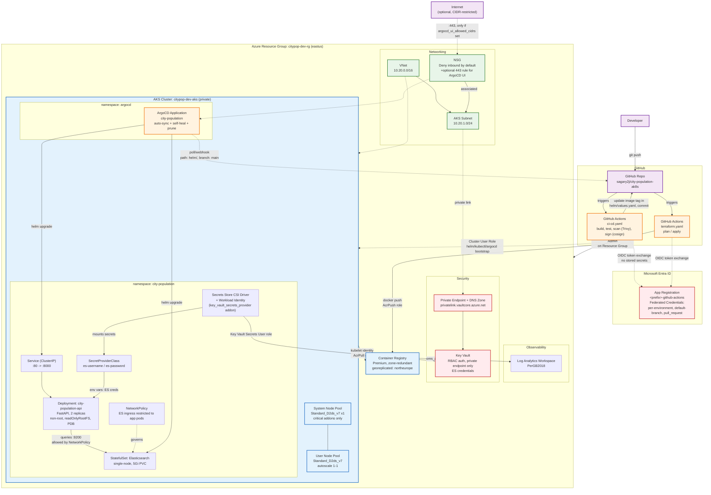

# City Population AKS - Architecture

**Project**: city-population-ak8s
**Cloud**: Azure
**Compute**: Azure Kubernetes Service (AKS), private cluster
**Pattern**: GitOps (ArgoCD) microservice - FastAPI + Elasticsearch, deployed via Helm

## Summary

This project deploys a single FastAPI microservice (`city-population-api`) backed by a
single-node Elasticsearch StatefulSet, running on a private AKS cluster. Infrastructure
is provisioned with Terraform (VNet, AKS, ACR, Key Vault, Log Analytics, GitHub OIDC
identity), and application delivery is GitOps-driven: GitHub Actions builds/pushes
container images to ACR and bumps the image tag in `helm/values.yaml`; ArgoCD polls the
repo and reconciles the Helm chart onto the cluster.

Security posture: AKS API server is private (no public endpoint), cluster auth is
Azure AD RBAC only (`local_account_disabled = true`), CI/CD authenticates via GitHub
OIDC federated credentials (no stored secrets), the ACR is pulled via the AKS kubelet
managed identity (no imagePullSecrets), and Elasticsearch credentials are sourced from
Key Vault through the Secrets Store CSI Driver + Workload Identity in production mode
(a plaintext `Secret` is used only for local/dev).

## Resource Inventory

| Resource | Type | Key Config |
|---|---|---|
| `citypop-dev-rg` | Resource Group | eastus |
| `citypop-dev-vnet` | Virtual Network | 10.20.0.0/16 |
| `citypop-dev-aks-subnet` | Subnet | 10.20.1.0/24 |
| `citypop-dev-aks-nsg` | Network Security Group | Deny inbound by default; optional 443 rule for ArgoCD UI |
| `citypop-dev-law` | Log Analytics Workspace | PerGB2018, Container Insights (oms_agent) |
| `citypop<env>acr<suffix>` | Container Registry | Premium SKU, zone-redundant, georeplicated to northeurope |
| `citypop-dev-aks` | AKS Cluster | Private, Azure AD RBAC, workload identity + OIDC issuer, Azure Policy, image cleaner |
| `system` node pool | AKS Node Pool | Standard_D2ds_v7, 1 node, `only_critical_addons_enabled` |
| `user` node pool | AKS Node Pool | Standard_D2ds_v7, autoscale 1–1, label `workload=city-population` |
| `citypop-dev-kv-<suffix>` | Key Vault | RBAC-authorized, private endpoint only, soft-delete 7d |
| Key Vault Private Endpoint + DNS Zone | Private Networking | `privatelink.vaultcore.azure.net` |
| `<prefix>-github-actions` | Entra ID App + SP | GitHub OIDC federated credentials (per environment, default branch, PRs) |
| ArgoCD `Application: city-population` | GitOps controller | Auto-sync + self-heal, source: `helm/` path on `main` |
| `city-population-api` Deployment | Kubernetes Deployment | 2 replicas, non-root, readOnlyRootFS, PDB, optional HPA |
| Elasticsearch StatefulSet | Kubernetes StatefulSet | Single-node, 5Gi PVC, security disabled (dev) |
| `SecretProviderClass` | CSI Secrets Store | Mounts `es-username`/`es-password` from Key Vault (prod mode) |
| `NetworkPolicy` | Kubernetes NetworkPolicy | Restricts ES ingress (9200) to app pods only; 9300 to ES peers |

## Architecture Diagram

## Relationship Details

- **CI/CD → Azure (OIDC)**: GitHub Actions authenticates to Entra ID via federated
  credentials (`terraform/identity.tf`) - no client secrets stored in GitHub. Separate
  federated credentials exist for each GitHub Environment (`dev`, `prod`), the default
  branch (for Terraform plan/apply), and `pull_request` events (for PR-time `terraform
  plan`).
- **Image build/push**: `ci-cd.yaml` builds the FastAPI image, scans it (Trivy), signs it
  (cosign), and pushes to ACR using the `AcrPush` role, then commits the new image tag
  into `helm/values.yaml` on `main`.
- **GitOps reconciliation**: The ArgoCD `Application` (`argocd/application.yaml`) polls
  the repo's `helm/` path on `main` with `automated: {prune, selfHeal}`, so any commit
  (including the CI image-tag bump) is reconciled onto the cluster automatically.
- **Image pull (no secrets)**: AKS's kubelet managed identity is granted `AcrPull` on the
  ACR directly (`azurerm_role_assignment.aks_acr_pull`), so pods need no
  `imagePullSecrets`.
- **Secrets flow**: The AKS `key_vault_secrets_provider` add-on identity is granted `Key
  Vault Secrets User` on the private Key Vault. The `SecretProviderClass`
  (`helm/templates/secretproviderclass.yaml`) uses that identity (Workload Identity, not
  pod identity/VM identity) to mount `es-username`/`es-password` as a Kubernetes Secret
  consumed by the app Deployment's env vars. This path is disabled by default
  (`app.keyVault.enabled: false`) in favor of a plaintext dev `Secret` for local/dev use.
- **Network isolation**: A `NetworkPolicy` restricts inbound traffic to the Elasticsearch
  pods to only the app pods (port 9200) and other ES pods (port 9300, for future multi-
  node scaling). No other workload in the namespace/cluster can reach ES directly.
- **Private cluster access**: The AKS API server has no public endpoint
  (`private_cluster_enabled = true`); the only access path is `az aks command invoke`
  (management-plane Azure RBAC), and `local_account_disabled = true` forces all
  `kubectl` access through Azure AD + Azure RBAC - there are no local cluster admin
  accounts.
- **Optional public ingress**: The NSG has no inbound-from-internet rule by default; a
  rule is conditionally created (`var.argocd_ui_allowed_cidrs`) to allow a CIDR-limited
  set of IPs to reach the ArgoCD UI's public LoadBalancer Service on 443, for the
  `scripts/bootstrap-argocd.sh --expose-ui` workflow.
- **Observability**: The AKS `oms_agent` add-on ships Container Insights data to the Log
  Analytics Workspace for cluster/pod-level monitoring.

## Notes / Recommendations

- Elasticsearch is currently a **single-node** dev deployment (see the README's
  production roadmap section for the HA topology: dedicated master/data/ingest roles
  across 3+ AZs with snapshots).
- `enable_key_vault` and `app.keyVault.enabled` are independent toggles, Key Vault
  infrastructure can exist while the app still uses the plaintext dev Secret; flip both
  on together to fully switch to Key Vault-backed secrets.
- The subscription is capped at 4 total vCPUs/region (Free Trial), which is why
  `host_encryption_enabled = false` on both node pools and why node counts are minimal
  (1 system + 1 user, no autoscaler headroom beyond min=max=1).
